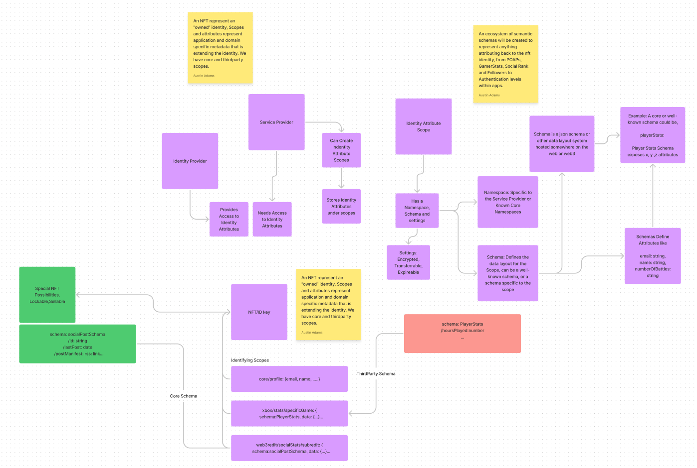

## NFT Based Identity Protocol 
NFTs have brought a new form of digital ownership to the web, they are growing so fast and finding product market fit for many use cases. 
Metaplex believes that one of these use cases is Self Sovereign identity. In this program we present a protocol for using NFTs as the basis for a decentralized identity system.
The core concepts are inspired by many of the current auth-n/auth-z protocols today but with changes to who owns and controls what data. 

### Goals
* Provide verifiable unique identity.
* Allow people to connect and manage existing identity systems (email, other nameservices, twitter, etc.), in a verified way.
* Support separate parts of people’s lives, shared in different contexts.  Ex: work, personal, hobby, temporary.
* Users must feel absolutely safe and secure, with low risk for mis-sharing or losing information.

### Core Concepts


#### Owned Identity
An NFT represent an “owned” identity. The user is in complete control of who they represent themselves as, they can change the image, name, and any other attributes. They can self custody this asset forever.
Daaps and other compatible legacy applications will use the current wallet presented to them to find an Identity NFT that the user wants to present. The Dapp uses this NFT to understand who the user is, what their preferences are and what they will allow that Dapp to do with their private information.

**Why does this matter?**

By standardizing identity to an owned asset on a censorship resistant system we make user accounts and social media presentation fungible to other platforms. 
While a user may become banned from one platform they can still carry their owned identity with all its history on to another platform and choose to share content with that new platform. 
Currently a user must start over and convince followers that they are the same person. 

#### Service Providers
A service provider in the Identity System is any System or Thirparty Dapp that wants to contribute to or use any information from a users identity.

**For example:** 

A KYC provider wants to use the NFT identity personal information to prefill sensitive and encrypted information on their KYC forms. The user must grant this interaction before an ephemeral decryption key is provided to the KYC provider.
Once the relationship is established the KYC provider can use the NFT identity to decrypt sensitive information and write KYC and AML information in an encrypted way against the users' identity.
The user now has control over who besides the KYC provider can access their global KYC.
Then a marketplace dapp that wants to use the users global and encrypted KYC and AML information provided through this other provider so the user behind the identity can start trading sweet JPEGs right away.
The user will allow the marketplace access to the users identity and the KYC and AML information, and a decryption key and the data/instructions on how to proceed is provided.
The marketplace may also want to store the users trading history, botting behavior against the users identity. 
The marketplace could store this information under a specific third party allocated place called a "scope" in a structured way.

As you saw above we call the structured data that a service provider stores on an Identity NFT a "scope". 

#### Scopes of Identity
Attached to an owned identity are scopes. These are an atomic unit of personal information that the user can control. 
They can be "core" scopes over which the user has direct write access, or they may be third party scopes that describe the users presence on a third party platform.
* Core scope examples are things like preferences, privacy settings, default identity, account links. 
* Third party scopes are things like posts on a specific social media site, the users number of game hours played.

Scopes have an authority, this authority can be the identity system itself, the user or a third party.
Scopes have an access control system, that puts the user(holder of the identity) in control of their personal data.

The authority has direct write access and read access to the scope that they control.
The authority can grant read/write access to scopes that they control.
Third party scopes must be given permission to write to a user identity and the user has the permission to remove it under certain conditions.
Third party scopes must depend on a core scope from the user to be able to write to the user identity, this ensure that there is a relationship between the user and the "Service Provider"

### Use Cases
* User Authentication
* Encrypted User Content Permission
* Cross Dapp preferences and settings
* Cross Dapp KYC AML potential for identity verification

### Compatible with
* W3C DID https://www.w3.org/TR/did-core/
* OAUTH2/OIDC flows

### Inspiration
https://jose.readthedocs.io/en/latest/
https://github.com/mozilla/hawk
https://developer.okta.com/docs/concepts/oauth-openid/
https://datatracker.ietf.org/doc/html/draft-hardjono-oauth-decentralized-00
https://www.w3.org/TR/did-core/

## Background

Solana's programming model and the definitions of the Solana terms used in this
document are available at:

- https://docs.solana.com/apps
- https://docs.solana.com/terminology

## Testing
```sh
cargo test-bpf --bpf-out-dir ../../target/deploy/
```
## Building
```sh
cargo build-bpf --bpf-out-dir ../../target/deploy/
```

## Source

The Identity Program's source is available on
[github](https://github.com/metaplex-foundation/metaplex-program-library)

There is also an example Rust client located at
[github](https://github.com/metaplex-foundation/metaplex-program-library/tree/master/token-metadata/test/src/main.rs)
that can be perused for learning and run if desired with `cargo run --bin metaplex-token-metadata-test-client`. It allows testing out a variety of scenarios.

## Interface (Coming Soon)

The on-chain Identity Program is written in Rust and available on crates.io as
[mpl-identity](https://crates.io/crates/mpl-identity) and
[docs.rs](https://docs.rs/mpl-identity).

